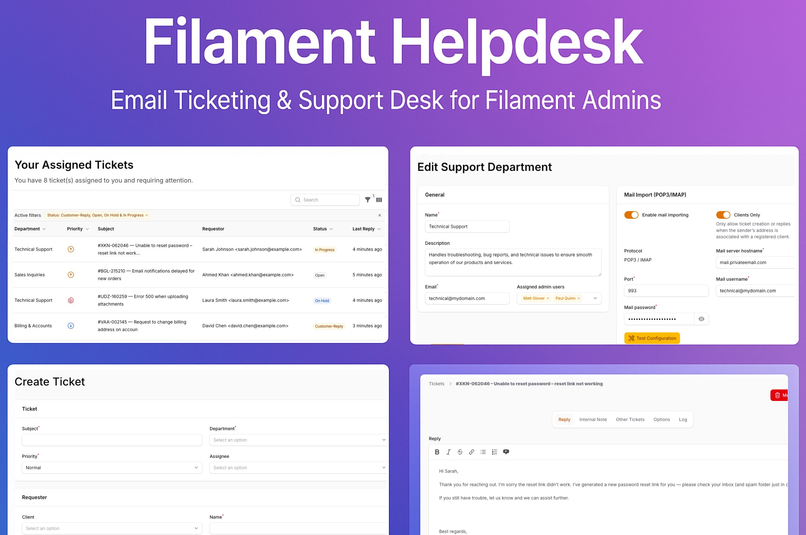

# Filament Helpdesk

A **Filament 4 plugin** that provides a support ticket desk for your Laravel application. Designed for teams who want to manage customer tickets directly inside their Filament admin panel.

Easily create, track, and manage customer support requests with features like departments, email integration, internal notes, assignments, priorities, and more.





## ✨ Features

-    **Ticket Management**: Create, assign, and track support tickets with status, priority, and department fields.
-    **Requester & Client Integration**: Automatically link tickets to your application's users (clients) with name and email.
-    **Email Import (IMAP/POP3)**: Automatically fetch emails from a mailbox and convert them into tickets or replies.
-    **Direct Email Replies**: Reply to tickets directly from the Filament panel; replies are sent to the requester via email.
-    **Notifications**: Automated email notifications for staff and requesters, plus in-app notifications for staff assignments and replies.
-    **Internal Notes**: Collaborate with your team by adding private notes to tickets that are invisible to the requester.
-    **File Attachments**: Upload and manage file attachments for both tickets and individual messages.
-    **Dashboard Widgets**: Includes "All Tickets" and "My Assigned Tickets" widgets to get a quick overview.
-    **Filtering & Badges**: Filter tickets by status, priority, and department. The navigation badge displays the number of active tickets that require attention.
-    **Permission System**: Restrict access based on global admin status or department membership.
-    **Soft Deletes**: Safely move tickets to the trash, restore them, or force delete them permanently.

-    
## Licences
You can buy a license for the plugin on the [AnyStack](https://checkout.anystack.sh/filament-advanced-choice) website.

## Installation

Make sure you add the following repository to your `composer.json` file:

```json
{
    "repositories": [
        {
            "type": "composer",
            "url": "https://filament-advanced-choice.composer.sh"
        }
    ],
}
```

Then, run the following command to install the package:

```bash
composer require codewithdennis/filament-advanced-choice
```

To activate your license, use your email address as the username. For the password, you must enter your license key followed immediately by your activation fingerprint — both are required.

```bash 
Loading composer repositories with package information
Authentication required (filament-advanced-choice.composer.sh):
Username: info@codewithdennis.nl
Password: 8c210f8f-6173-3932-c4ba-8bcc723ef500:codewithdennis.nl
```

To clarify, the license key and fingerprint should be separated by a colon (:).

2.  **Run the migrations:**
    This will create the necessary tables for tickets, messages, departments, etc.
    ```bash
    php artisan migrate
    ```
    
3.  **Register the plugin in your Panel Provider:**
    In your `app/Providers/Filament/AdminPanelProvider.php` (or the panel provider you use), add the plugin to the `plugin()` method:
    ```php
    use Umnidev\AdvancedSupportDesk\AdvancedSupportDeskPlugin;

    public function panel(Panel $panel): Panel
    {
        return $panel
            // ...
            ->plugin(
                AdvancedSupportDeskPlugin::make()
            );
    }
    ```
---


---

## 📥 Email Import (IMAP/POP3) Setup

To automatically create tickets from incoming emails, follow these steps:

1. **Configure a Department**  
   In your Filament admin panel, navigate to **Support > Departments**.  
   Create a new department and fill in the *Mail Import* section with your IMAP or POP3 server credentials.  
   Enable the **Mail Import Enabled** toggle.

2. **Schedule the Fetch Command**  
   The plugin includes an Artisan command to fetch mail.  
   You need to schedule it to run periodically in your `app/Console/Kernel.php` file.

3. **Ensure Your Scheduler is Running**  
   Make sure you have a single cron entry on your server to run the Laravel scheduler,  
   as described in the Laravel documentation.

---

## 🔒 Permissions

The plugin defines two levels of access:

- **Global Admin** → Can see and manage all tickets from all departments.  
- **Department Admin** → Can only see and manage tickets assigned to their department or directly to them.

---

## 🚀 Installation

Getting started is easy. Just follow these steps.

1.  **Install the plugin via Composer:**
    ```bash
    composer require your-vendor/your-package-name
    ```

2.  **Run the migrations:**
    This will create the necessary tables for tickets, messages, departments, and other related tables.
    ```bash
    php artisan migrate
    ```

3.  **Register the plugin in your Panel Provider:**
    In your `app/Providers/Filament/AdminPanelProvider.php` add the plugin to the `plugin()` method:
    ```php
    use Umnidev\Helpdesk\HelpdeskPlugin;

    public function panel(Panel $panel): Panel
    {
        return $panel
            // ...
            ->plugin(
                Helpdesk::make()
            );
    }
    ```

---

## ⚙️ Configuration

Publish the configuration file to customize the plugin's behavior.

```bash
php artisan vendor:publish --tag="advanced-support-desk-config"
```
